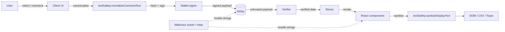

# Signing-Flow Threat Model

STRIDE-style threat model for the swap, registration, and vote signing flows.
Companion to [`docs/security-audit.md`](./security-audit.md) (issue #247) and
referenced from [`SECURITY.md`](../SECURITY.md).

## 1. Scope

In scope:

- Swap intent creation and signing (`src/lib/wallet/signMessage.ts`).
- Solver registration and profile display.
- Governance proposal creation, voting, and discussion comments
  (`src/app/governance/**`, `src/lib/governanceStore.ts`).
- Every surface that renders externally supplied data: ActivityFeed, Explore
  rows, intent detail, solver leaderboard/profile, governance proposals and
  comments, toasts (including `href`), command palette suggestions, and CSV
  export.

Out of scope: penetration testing of the backend, relay infrastructure
hardening, and key custody.

## 2. Actors

| Actor | Capability | Motivation |
| --- | --- | --- |
| Malicious relay | Controls ordering and delivery of signed payloads; can drop, delay, or replay messages | Censor, front-run, or misattribute signatures |
| Malicious solver | Supplies free-text fields (name, memo, comment) rendered to other users | Inject script/URL payloads, spoof addresses, poison CSV exports |
| Network attacker | On-path between client and relay | Tamper with unsigned data, downgrade transport |
| Malicious dApp page / extension | Runs in the same origin or injects into the DOM | Read signing payloads, rewrite displayed intent before the user signs |
| Phishing site | Impersonates the app | Harvest signatures or seed malicious intents |

## 3. Assets

- **A1** User private keys / signing capability.
- **A2** Integrity of the signed message (what the user believes they signed).
- **A3** Displayed intent, solver, and governance data.
- **A4** Session and origin integrity of the app itself.
- **A5** Exported artefacts (CSV) consumed by spreadsheets.

## 4. Trust boundaries

1. **Wallet boundary** — the signer is trusted; everything crossing into it
   must be canonicalised (`normalizeCommentText`).
2. **Relay boundary** — relay-supplied data is untrusted; it is only trusted
   after signature verification.
3. **Render boundary** — all externally supplied strings are untrusted at the
   point they enter the React tree.
4. **Origin boundary** — navigation targets derived from user data must stay
   same-origin relative paths.

## 5. Data-flow diagram

## 6. STRIDE threats and mitigations

| STRIDE | Threat | Mitigation | Code location | Test |
| --- | --- | --- | --- | --- |
| Spoofing | Homoglyph/bidi solver name impersonates a known solver | Strip bidi + zero-width code points | `src/lib/textSafety.ts` `sanitizeDisplayText` | `src/test/hostileStrings.test.ts` |
| Tampering | Relay alters comment text after signing | NFC + newline canonicalisation before hashing | `normalizeCommentText` | `src/test/hostileStrings.test.ts` |
| Repudiation | Signer and verifier hash different bytes | Single canonical form shared by both sides | `normalizeCommentText` | `src/test/hostileStrings.test.ts` |
| Information disclosure | Malicious dApp reads signing payload | Payload shown verbatim before signing; no auto-sign | `src/lib/wallet/signMessage.ts` | manual review |
| Denial of service | Extremely long strings freeze render | Length bounds enforced | `COMMENT_MAX_LENGTH` | `src/test/hostileStrings.test.ts` |
| Elevation of privilege | `javascript:` / `data:text/html` href in toast or link | Same-origin relative-path-only href validation | `src/store/toast.ts` | `src/test/hostileStrings.test.ts` |
| Injection | Script tags / event handlers in rendered fields | React escaping + DOM attribute walk assertion | all renderers | `src/test/hostileStrings.test.ts` |
| Injection | CSV formula trigger (`=`, `+`, `-`, `@`) in export | Prefix neutralisation on export | CSV export | `src/test/hostileStrings.test.ts` |

## 7. Assumptions

- The relay is **untrusted**; only signature-verified data is trusted.
- Solvers are **untrusted** for all free-text fields.
- React escaping is relied upon for text nodes, but is **enforced** by the
  hostile-string regression suite rather than assumed.
- Navigation targets derived from user data are restricted to same-origin
  relative paths.

## 8. Residual risk

- Backend penetration testing is out of scope.
- Browser extension compromise of the origin is not fully mitigable client-side.
