# Transaction flow state machine

`useSwapSubmission`, `useSolverRegistration` and `useAcceptIntent` all run on the
shared machine in [`src/lib/flow`](../src/lib/flow):

- [`machine.ts`](../src/lib/flow/machine.ts) — pure `flowReducer` with guarded
  transitions. An illegal event returns the same snapshot (a no-op).
- [`errors.ts`](../src/lib/flow/errors.ts) — shared `classifyFlowError`
  (`network`, `user-rejected`, `balance`, `no-solver`, `validation`, `generic`)
  and i18n keys for guidance (`flow.error.*`).
- [`useTransactionFlow.ts`](../src/lib/flow/useTransactionFlow.ts) — the React
  hook. Flows pass a `run(params, { signal, step })` handler; each
  `step(name, handler)` enters a state and receives the run's `AbortSignal`.

## Statechart

```mermaid
stateDiagram-v2
  [*] --> idle
  idle --> pending: START
  error --> pending: START (user retry)
  success --> pending: START
  state pending {
    connecting --> building
    building --> reviewing
    reviewing --> awaiting_signature
    awaiting_signature --> submitting
    note right of connecting: ADVANCE only moves forward;\nsteps may be skipped
  }
  pending --> success: SUCCEED
  pending --> error: FAIL (records errorStep)
  pending --> idle: CANCEL
  success --> idle: RESET
  error --> idle: RESET
```

## Guarantees

- **Double submit** — `start()` is ignored while a run is pending (guarded by a
  ref, so two clicks in the same tick cannot both start).
- **Cancellation** — `cancel()`, `reset()`, unmount, and a wallet switch or
  disconnect abort the run's `AbortSignal` (forwarded to `apiFetch`) and return
  the machine to `idle`. Cancelled runs never set an error or toast.
- **Late responses** — every event carries a `runId`; results that arrive after
  a cancel, or from a superseded run, are discarded.
- **No silent re-prompts** — nothing is retried automatically. `retry()` only
  re-runs the last failed params when the user asks, so a `user-rejected`
  signature is never replayed without fresh consent.
- **Strict mode** — runs are only created by user actions, so the mount/unmount
  probe of React strict mode cannot abort or duplicate one.
